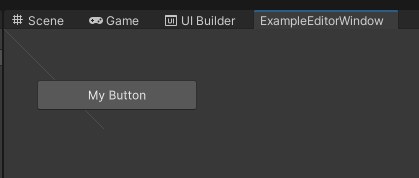
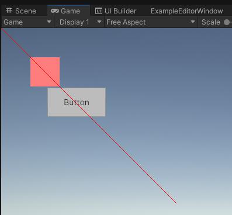

# Readme

This is a simple example of how UI Toolkit and GL draw calls are interacting.

In an EditorWindow, inside a OnGUI call, I am trying to display a line on top of the UI elements, but the line is displayed behind the UI elements.



The code:

```C#
public void OnGUI()
    {
        CreateLineMaterial();
        // Apply the line material
        lineMaterial.SetPass(0);

        GL.PushMatrix();
        // Set transformation matrix for drawing to
        // match our transform
        // GL.MultMatrix(transform.localToWorldMatrix);

        // Draw lines
        GL.Begin(GL.LINES);
        for (int i = 0; i < lineCount; ++i)
        {
            float a = i / (float)lineCount;
            float angle = a * Mathf.PI * 2;
            // Vertex colors change from red to green
            GL.Color(new Color(a, 1 - a, 0, 0.8F));
            // One vertex at transform position
            GL.Vertex3(0, 0, 0);
            // Another vertex at edge of circle
            GL.Vertex3(100, 100, 0);
        }
        GL.End();
        GL.PopMatrix();
    }
```

In a MonoBehaviour, I am trying exactly the same thing, and the line is displayed on top of the UI Elements, as I would have wanted.


